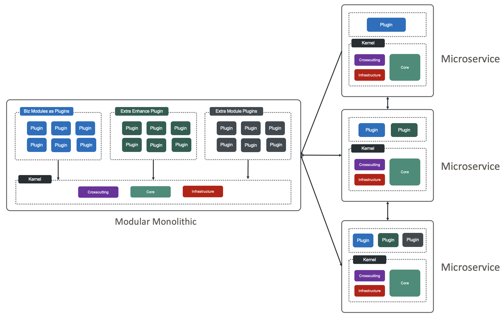
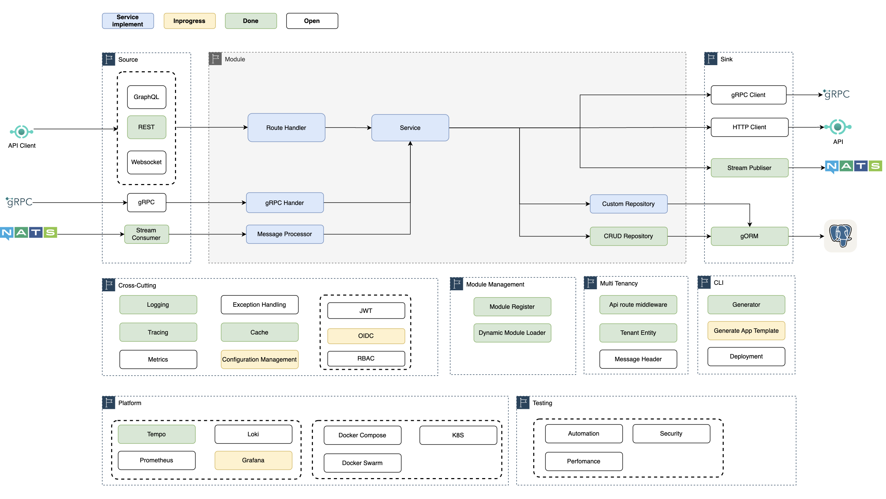

# eBrick Framework

## Elastic Architecture Overview



This architecture combines modular monolithic design, kernel architecture, and microservices to provide an elastic structure that supports rapid transformation between monolithic and microservice configurations. It starts as a modular monolith with a kernel at its core, managing business, enhancement, and extra plugins. As the system evolves, modules can be easily extracted into independent microservices or reintegrated, allowing flexibility, scalability, and seamless adaptation to changing requirements.

## eBrick Framework Overview

**eBrick Framework** – a robust and flexible platform designed for building Elastic Applications which inspired by elastic architecture. The eBrick Framework leverages a brick architecture, seamlessly combining modular components, microservices, and a core kernel to facilitate the development of scalable and adaptable software solutions. Integrating the principles of clean architecture, eBrick ensures each layer of your application remains decoupled and maintainable, allowing for easy modifications, testing, and deployment.

### Key Feature: Seamless Transition Between Architectures

One of the standout features of eBrick is its ability to support seamless transitions between monolithic and microservices architectures. You can start by building a monolithic application where all modules are integrated into a single, unified system. As your application grows, eBrick’s plug-and-play capability allows you to effortlessly transition to a microservices architecture, where each service contains one or more modules. If needed, you can just as easily transition back to a monolithic architecture, reintegrating the services into a single application. This flexibility ensures your application can evolve with your business needs, scaling up, breaking down, or consolidating as necessary—all without extensive rewrites or disruptions.


### Additionally, eBrick comes with out-of-the-box support for

- **Observability with OpenTelemetry**: Seamlessly monitor and trace your applications to ensure optimal performance and reliability.
- **Messaging with NATS JetStream**: Efficiently handle messaging across your microservices with a robust and scalable messaging system.
- **API Handling with Gin**: Develop high-performance APIs using the Gin framework, known for its speed and flexibility.
- **ORM with GORM**: Simplify database interactions with GORM, a powerful and developer-friendly ORM for Golang.
- **Multi-Tenancy**: Support multiple tenants within a single application instance, ensuring isolated and secure data handling for each tenant.

With eBrick, you’re equipped to build highly resilient, flexible, and observable applications that can easily adapt to your changing requirements, making it the ideal framework for dynamic and growing environments.

## Getting Started

### Install eBrick cli tool

```bash
export GOPRIVATE=github.com/trinitytechnology/ebrick
go install github.com/trinitytechnology/ebrick/cli/cmd/ebrick@latest
```

### Install from local folder (Local Development)

```bash
go install ./cli/cmd/ebrick
```

### Create new application

```bash
ebrick new app
```
